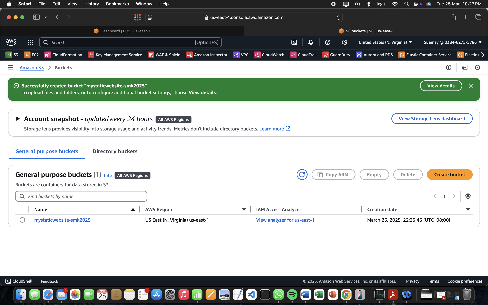

# Deploying a Static Website on Amazon S3

## Overview
This project demonstrates how to deploy a static HTML website using Amazon S3. The guide includes steps to configure an S3 bucket for static website hosting, modify permissions for public access, and test the website's accessibility via the internet.

## Prerequisites
- An AWS account with appropriate permissions to create and manage S3 buckets.
- Basic knowledge of AWS S3 and IAM policies.

## Steps to Deploy the Static Website

### 1. Create an S3 Bucket
- Navigate to the **S3 service** in the AWS console.
- Click **Create bucket**.
- Provide a unique name for your bucket.

 
 
- Choose the region where the bucket should be created.
- Disable **Block all public access** (This will be addressed in later steps).
- Click **Create bucket**.

 
  

### 2. Enable Static Website Hosting
- Select the created S3 bucket.
- Navigate to the **Properties** tab.
- 

  
- Scroll down to **Static website hosting**.
- Enable **Use this bucket to host a website**.


  
- Set the **index document** to `index.html`.
- Click **Save changes**.

### 3. Modify Public Access Settings
- Navigate to the **Permissions** tab.
- Click **Edit** under "Block public access".
- Uncheck **Block all public access**.
- Confirm the changes and click **Save**.

### 4. Apply a Bucket Policy
- In the **Permissions** tab, scroll down to **Bucket policy**.
- Add the following policy to allow public read access to the objects:

```json
{
    "Version": "2012-10-17",
    "Statement": [
        {
            "Sid": "PublicReadGetObject",
            "Effect": "Allow",
            "Principal": "*",
            "Action": "s3:GetObject",
            "Resource": "arn:aws:s3:::YOUR_BUCKET_NAME/*"
        }
    ]
}
```

- Replace `YOUR_BUCKET_NAME` with the actual name of your S3 bucket.
- Click **Save**.

### 5. Upload Website Files
- Create an `index.html` file with the following content:

```html
<!DOCTYPE html>
<html>
<head>
    <title>My First Website</title>
</head>
<body>
    <h1>Hello world!</h1>
    <p>I'm hosted on Amazon S3!</p>
    
</body>    
</html>
```

- Create an `error.html` file with relevant error information.
- Upload both `index.html` and `error.html` to the root of your S3 bucket.

### 6. Test the Website
- Navigate to the **Properties** tab in your bucket.
- Click on the **Bucket website endpoint**.
- If everything is configured correctly, your website should be accessible.
- If you see a `403 Forbidden` error, double-check your bucket policy and public access settings.

